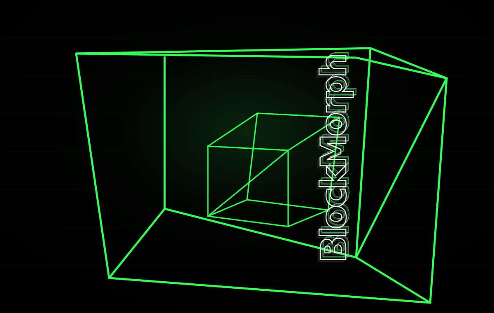

# BlockMorph



**BlockMorph is a privacy-preserving Solana identity and access layer.** It lets a user prove that a main Solana wallet has reputation or eligibility, then morph that reputation into a fresh purpose-specific **Morph Wallet** for a campaign, whitelist, presale, DAO gate, private airdrop, or AI-agent session.

The core idea is simple:

> **Morph one Solana wallet into many private proof-identities.**

A user keeps their main wallet private from partners. BlockMorph checks the proving wallet, signs a portable **BlockMorph Capsule**, and partners verify/register only the Morph Wallet and capsule metadata.

## What BlockMorph does

BlockMorph solves a common Solana access problem: projects want to gate access by wallet reputation, but users do not always want to reveal their main wallet to every campaign.

BlockMorph provides:

- **Private wallet reputation** - prove wallet age, transaction activity, SOL balance, and estimated visible SOL movement from real Solana RPC reads.
- **Morph Wallets** - create a fresh Solana keypair in the browser for each campaign or agent session.
- **BlockMorph Capsules** - issuer-signed JSON credentials that state campaign scope, Morph Wallet, tier, policy hash, expiry, nullifier, and signature.
- **Campaign builder** - partners create policies, generate API keys, register Morph Wallets, export whitelists, and receive webhooks.
- **Public verifier** - anyone can paste/upload a capsule and verify schema, signature, expiry, policy hash, campaign status, and tier.
- **Agent-safe wallets** - users isolate funds in a Morph Wallet and export local signer policies for AI-agent sessions.
- **SDK/API** - external apps can verify capsules locally or call BlockMorph API routes.

## Why it matters

Without BlockMorph, a user often has to give a partner their main wallet address to prove eligibility. That can expose holdings, activity history, social identity links, and future behavior.

With BlockMorph:

1. The user connects their main wallet to BlockMorph.
2. BlockMorph reads real public Solana metrics and asks the wallet to sign a challenge.
3. The user creates a fresh Morph Wallet locally.
4. BlockMorph issues a signed capsule for that campaign.
5. The partner sees the Morph Wallet and capsule validity, not the proving wallet.

Important privacy statement:

> Partners never see your proving wallet. They only see your Morph Wallet, tier, campaign scope, and capsule validity.

In the current issuer-signed mode, BlockMorph does see and verify the proving wallet during capsule issuance. The proving wallet is intentionally not included in the capsule JSON.

## Current implementation status

This repository is not a fake landing page. It includes a working local/devnet full-stack app:

- Next.js App Router frontend.
- Phantom and Solflare wallet adapter support.
- Real Solana RPC reads through `@solana/web3.js`.
- Replay-protected challenge signing.
- Server-side Ed25519 issuer signing with `tweetnacl`.
- Prisma + SQLite persistence for local development.
- Campaign creation and private Morph Wallet registration.
- API-key hashing and Bearer-protected whitelist exports.
- Public capsule verification UI and API.
- Local SDK package at `packages/blockmorph-sdk`.
- Vitest coverage for core verification behavior.
- Noir/Barretenberg ZK skeleton only; production ZK is not claimed as live.

## Product flows

### 1. Landing page (`/`)

Explains BlockMorph and shows the black void / neon green wireframe visual identity:

- Private Wallet Reputation
- Morph Wallets
- Campaign Builder
- Agent-Safe Wallets
- SDK/API
- Advanced ZK architecture notes

### 2. Create Morph Capsule (`/morph`)

User flow:

1. Connect Phantom or Solflare.
2. Fetch public wallet metrics from the configured Solana RPC endpoint.
3. Select a campaign/policy.
4. Generate a fresh Morph Wallet in the browser.
5. Encrypt the Morph Wallet secret key locally with WebCrypto AES-GCM and a user password.
6. Sign a challenge message:

   ```text
   BlockMorph verification challenge: {nonce}
   ```

7. Submit only the public proving wallet, signature, challenge, campaign ID, and Morph Wallet public key to the backend.
8. Backend verifies the signature, computes eligibility, signs a capsule, and stores issuance metadata.
9. User downloads the capsule JSON or registers the Morph Wallet with the campaign.

The Morph Wallet secret key is never sent to the server.

### 3. Campaign dashboard (`/campaigns`)

Partner flow:

1. Create a campaign policy:
   - campaign name and slug
   - minimum wallet age
   - minimum transaction count
   - minimum SOL balance
   - minimum estimated visible SOL movement
   - allowed tiers
   - max registrations
   - expiry date
   - webhook URL
2. Receive a one-time API key.
3. View policy hash.
4. View registered Morph Wallets.
5. Export CSV whitelist with Bearer API key.
6. Rotate API key.
7. Disable or enable a campaign.
8. See registration counts by tier.

### 4. Public verifier (`/verify`)

Verifier checks:

- Capsule JSON schema is valid.
- Issuer signature is valid.
- Trusted issuer key matches.
- Capsule is not expired.
- Campaign exists and is enabled.
- Policy hash matches the current campaign policy.
- Capsule tier satisfies selected minimum tier.
- Morph Wallet address is valid.

The verifier does not display a main wallet because the capsule does not contain one.

### 5. Agent-safe Morph Wallet (`/agent-safe`)

This flow creates a separate Morph Wallet for AI-agent usage and a local policy:

- max SOL to fund
- allowed program IDs
- allowed destination wallets
- daily spend limit
- expiry date
- human approval requirement

It also displays a funding transaction message from the connected wallet to the Morph Wallet and includes a simple local transaction builder that refuses requests violating the policy.

Security limitation:

> Solana does not natively enforce arbitrary wallet policies. BlockMorph limits risk by isolating funds inside a separate Morph Wallet and enforcing policies in the BlockMorph signer UI/SDK.

### 6. Developer docs (`/docs`)

Documents:

- SDK usage
- API routes
- environment variables
- local/devnet setup
- privacy model
- security limitations
- ZK architecture status

## Capsule format

BlockMorph capsules are portable issuer-signed JSON credentials:

```json
{
  "type": "blockmorph_capsule_v1",
  "policyVersion": "blockmorph-policy-v1",
  "issuer": "BlockMorph",
  "issuerPublicKey": "...",
  "capsuleId": "...",
  "campaignId": "...",
  "tier": 1,
  "tierLabel": "BRONZE",
  "morphWallet": "...",
  "nullifier": "...",
  "policyHash": "...",
  "issuedAt": "...",
  "expiresAt": "...",
  "proofMode": "issuer-signed",
  "signature": "..."
}
```

Capsules intentionally do **not** include the proving wallet.

## Tiers

Default tiers:

| Tier | Requirements |
| --- | --- |
| BRONZE | wallet age >= 30 days, tx count >= 10 |
| SILVER | wallet age >= 90 days, tx count >= 50, and balance >= 0.5 SOL or estimated visible SOL movement >= 5 SOL |
| GOLD | wallet age >= 180 days, tx count >= 100, estimated visible SOL movement >= 25 SOL |
| OBSIDIAN | wallet age >= 365 days, tx count >= 250, estimated visible SOL movement >= 100 SOL |

Campaign policies can also require stricter minimums and allowed tiers.

## Solana metrics

The app reads real public Solana data:

- wallet public key
- SOL balance via `getBalance`
- transaction signatures via `getSignaturesForAddress`
- first-seen approximation from the oldest fetched signature block time
- transaction count estimate from fetched signatures
- recent activity count
- estimated visible SOL movement from parsed transactions where feasible

The 90-day volume metric is intentionally labeled **estimated visible SOL movement** because exact historical volume usually requires an indexer.

## Tech stack

- Next.js App Router
- TypeScript
- React
- Tailwind CSS
- React Three Fiber / Three.js
- `@solana/web3.js`
- Solana wallet adapter packages
- Phantom and Solflare support
- `tweetnacl`
- `bs58`
- `zod`
- Prisma 7
- SQLite for local development
- Vitest
- Local SDK package: `@blockmorph/sdk`

## Repository structure

```text
src/app/                         Next.js routes and API routes
src/app/morph/                   Capsule creation flow
src/app/campaigns/               Partner campaign dashboard
src/app/verify/                  Public capsule verifier
src/app/agent-safe/              Agent-safe Morph Wallet flow
src/components/                  UI and wallet components
src/lib/                         Server/client helpers and tests
packages/blockmorph-sdk/         Local verification SDK
prisma/                          Schema, migration, seed script
scripts/generate-issuer-keys.ts  Issuer key generation
circuits/morph_passport/         Future ZK circuit skeleton
docs/blockmorph-hero.svg         README hero artwork
```

## Quick start

Install dependencies:

```bash
npm install
```

Create the local database:

```bash
npx prisma migrate dev
```

Generate issuer keys and nullifier pepper:

```bash
npm run issuer:keys
```

Copy the printed values into `.env`, then seed a demo campaign:

```bash
npm run db:seed
```

Start the app:

```bash
npm run dev
```

Open:

```text
http://localhost:3000
```

The seeded `general-reputation` campaign is designed to work for local/devnet testing with a real connected wallet and the configured RPC endpoint.

## Environment

Copy `.env.example` to `.env`.

```bash
NEXT_PUBLIC_APP_URL=http://localhost:3000
NEXT_PUBLIC_SOLANA_NETWORK=devnet
NEXT_PUBLIC_SOLANA_RPC_URL=https://api.devnet.solana.com
BLOCKMORPH_ISSUER_SECRET_KEY=
BLOCKMORPH_ISSUER_PUBLIC_KEY=
BLOCKMORPH_NULLIFIER_PEPPER=
DATABASE_URL=file:./dev.db
NEXT_PUBLIC_MORPH_BADGE_ENABLED=false
BLOCKMORPH_DEV_MODE=false
BLOCKMORPH_DEV_SKIP_ZK=false
```

## API routes

| Route | Purpose |
| --- | --- |
| `GET /api/issuer` | Returns issuer public key and policy version. |
| `POST /api/challenge` | Creates a replay-protected wallet-signing challenge. |
| `POST /api/capsule/issue` | Verifies wallet signature, reads Solana metrics, computes tier, signs capsule. |
| `POST /api/capsule/verify` | Verifies capsule schema, signature, expiry, campaign, policy hash, and tier. |
| `GET /api/campaigns` | Lists recent campaigns. |
| `POST /api/campaigns` | Creates a campaign and returns its API key once. |
| `GET /api/campaigns/:campaignId` | Returns campaign and registration summary. |
| `PATCH /api/campaigns/:campaignId` | Rotates API key or enables/disables a campaign with Bearer key. |
| `GET /api/campaigns/:campaignId/whitelist` | Returns JSON or CSV whitelist with Bearer key. |
| `POST /api/campaigns/:campaignId/register` | Verifies a capsule and registers the Morph Wallet. |
| `POST /api/webhooks/test` | Sends a sample webhook payload. |

## SDK

The local SDK exports:

- `parseCapsuleJson`
- `verifyCapsuleSignature`
- `verifyCapsule`
- `BlockMorphClient`
- `isValidSolanaAddress`
- `createPolicyHash`
- `TIER_LABELS`
- `CAPSULE_VERSION`

Example:

```ts
import { parseCapsuleJson, verifyCapsule } from "@blockmorph/sdk";

const capsule = parseCapsuleJson(json);
const result = verifyCapsule(capsule, {
  issuerPublicKey: process.env.BLOCKMORPH_ISSUER_PUBLIC_KEY,
  minTier: 2,
});

if (!result.valid) {
  console.error(result.reasons);
}
```

## Database models

Prisma models:

- `Campaign`
- `Registration`
- `IssuedCapsule`
- `WebhookEvent`
- `ChallengeNonce`

API keys are stored as hashes. Duplicate nullifiers are prevented per campaign for both issued capsules and registrations.

## Privacy model

BlockMorph separates three identities:

1. **Proving wallet** - the user main wallet used to prove reputation.
2. **Morph Wallet** - a fresh wallet generated locally for a specific campaign or agent session.
3. **Partner identity** - the partner only receives the Morph Wallet and capsule data.

In issuer-signed mode:

- BlockMorph sees the proving wallet during issuance.
- Partners do not see the proving wallet.
- Capsule JSON does not include the proving wallet.
- Nullifiers prevent duplicate issuance/registration without exposing the wallet to partners.

Future ZK mode is planned as a root/proof-based architecture, but this repo does not claim production ZK until real proof generation and verification are implemented.

## Security limitations

- Solana wallet age and transaction count are estimates bounded by fetched RPC signatures.
- Estimated visible SOL movement is not a full indexer-grade volume calculation.
- Morph Wallet backups are encrypted locally, but users must protect their password and backup file.
- Solana does not natively enforce arbitrary AI-agent wallet policies; BlockMorph policy checks run in the signer UI/SDK.
- Webhooks are basic outbound POSTs and should be hardened for production with retries, signatures, and delivery monitoring.
- SQLite is the local development database. The Prisma schema is structured so it can be moved to Postgres for production.

## ZK status

The current app implements **issuer-signed capsules** fully.

ZK directories exist as scaffolding:

```text
circuits/morph_passport/
src/lib/zk/
```

A production ZK mode should use real Noir/Barretenberg proving and verification. `BLOCKMORPH_DEV_SKIP_ZK` is reserved for local UI work and must never be presented as production ZK.

## Scripts

- `npm run dev` - run Next.js.
- `npm run build` - generate Prisma client and build Next.js.
- `npm run lint` - run ESLint.
- `npm run test` - run Vitest tests.
- `npm run issuer:keys` - generate issuer Ed25519 keys and nullifier pepper.
- `npm run db:seed` - create a demo `general-reputation` campaign.

## Validation

The implementation has been checked with:

```bash
npm run lint
npm run test
npm run build
npx prisma migrate dev --name init
npm run db:seed
```
